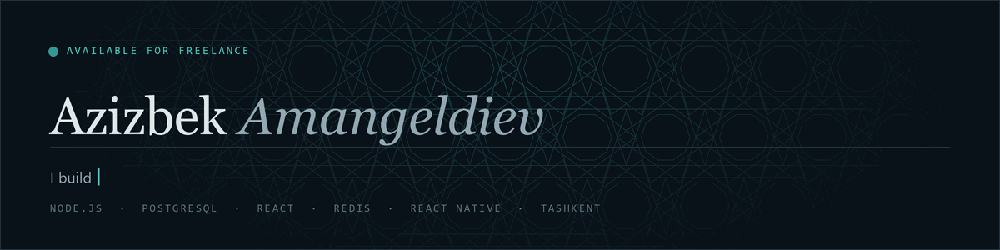
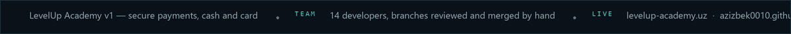
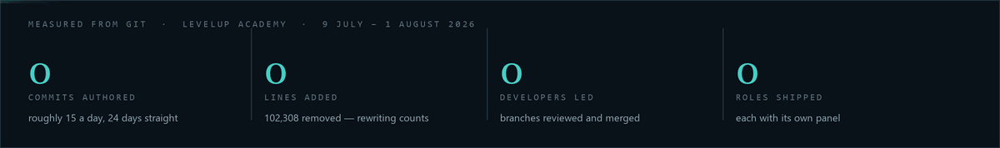
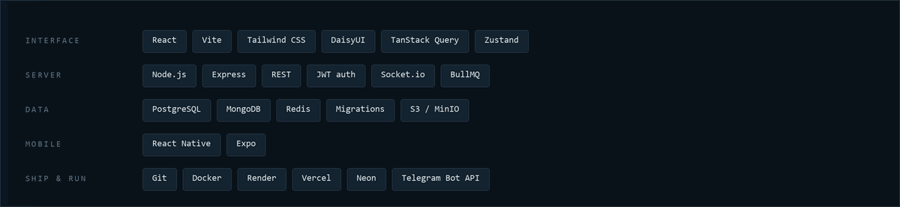

  
  
  
  

## About me

- I build production systems end to end — database schema, migrations, API, interface, deploy.
- I lead a **14-developer team** on LevelUp Academy: I review every branch and do the merges by hand.
- Money is the part I take most seriously. Invoices, split payments, instalments — they have to
  reconcile to the som, or the business stops trusting the software.
- I work at night. The numbers below are one month of that, counted with `git`, not estimated.

## Focus areas

- **Multi-tenant SaaS** — one backend, many organisations, scoped so nothing leaks between them
- **Payment flows** — cash and card, split across transactions, instalments that never double-charge
- **Operations tooling** — photo-backed audit trails, reconciliation, reports in local time
- **Mobile with React Native** — for the people who work away from a desk

## Selected work

| Project | What it is | Stack |
|---|---|---|
| **[LevelUp Academy](https://levelup-academy.uz)** | Multi-tenant CRM for education centres — 7 roles, live in production. Architect and team lead | Node.js · Express · PostgreSQL · Redis · BullMQ · Socket.io · React |
| **[Greenhouse](https://github.com/Azizbek0010/GreenHouse)** | Operations and anti-fraud system — photo-backed stock audit, split payments. Sole developer | React Native · Expo · Express · MongoDB · React |
| **[Portfolio](https://azizbek0010.github.io/portfolio/)** | My own site — hand-drawn girih canvas, no framework, no dependencies | HTML · CSS · Canvas |
| **[ATTO](https://github.com/Azizbek0010/ATTO-backend)** | Client project, frontend and backend against an API I deployed myself | JavaScript · Node.js · REST |

### LevelUp Academy, in more detail

One backend serving many partner organisations, each scoped down to its own branches, staff and
students. Seven roles, each with a panel of its own. Realtime chat and presence over Socket.io.
Telegram notifications go through a queue, so nothing is lost on a bad connection. The hard part
is money: invoices, cash and card, split payments spread across several transactions, and
instalment plans that must never double-charge.

### Greenhouse, in more detail

A flower business was losing money somewhere between the greenhouse and the till. Now every
movement of stock is photographed where it happens, so intake, sale and write-off reconcile
against each other later. Cashiers split a single sale across cash, card and debt; the owner
reads this month against the last one, in Tashkent time rather than the server's.

## Stack

<h4 align="center">Languages</h4>

  &nbsp;&nbsp;
  &nbsp;&nbsp;
  &nbsp;&nbsp;
  

<h4 align="center">Frontend</h4>

  &nbsp;&nbsp;
  &nbsp;&nbsp;
  &nbsp;&nbsp;
  &nbsp;&nbsp;
  

<h4 align="center">Backend &amp; Data</h4>

  &nbsp;&nbsp;
  &nbsp;&nbsp;
  &nbsp;&nbsp;
  &nbsp;&nbsp;
  &nbsp;&nbsp;
  &nbsp;&nbsp;
  

<h4 align="center">Mobile</h4>

  &nbsp;&nbsp;
  

<h4 align="center">DevOps &amp; Tools</h4>

  &nbsp;&nbsp;
  &nbsp;&nbsp;
  &nbsp;&nbsp;
  &nbsp;&nbsp;
  &nbsp;&nbsp;
  &nbsp;&nbsp;
  &nbsp;&nbsp;
  

Everything above is in something already deployed — not a list of things I have read about.

## What you can hand me

| | |
|---|---|
| **Full-stack apps** | Frontend, API and database as one piece of work, deployed and handed over running |
| **Dashboards and CRM** | Roles, permissions, money and reports — the internal tooling a business runs on |
| **REST APIs** | Documented endpoints, real auth, migrations, a schema that survives growth |
| **Telegram bots** | Notifications and flows people already live in, queued against bad connections |
| **Landing pages** | Fast, responsive, wired to wherever the enquiries need to land |
| **Fixes and speed** | Someone else's codebase that broke or crawls. I find the real cause, not the first symptom |

## Connect

**Portfolio** — [azizbek0010.github.io/portfolio](https://azizbek0010.github.io/portfolio/)
**Telegram** — [@Azizbek2603](https://t.me/Azizbek2603)
**Email** — [amangeldiev.azizbek.010@gmail.com](mailto:amangeldiev.azizbek.010@gmail.com)

Tashkent, Uzbekistan. Open to freelance work.
