I build software that a business opens every morning and cannot get through the day
without. That usually means roles and permissions, money that has to reconcile down to
the last transaction, and a mobile screen for whoever is standing away from a desk.

Based in Tashkent, Uzbekistan. Currently open to freelance work.

## What I build

### [LevelUp Academy](https://levelup-academy.uz) &nbsp;·&nbsp; live
**Multi-tenant education CRM** — architect and team lead

One backend serving many partner organisations, each scoped down to its own branches,
staff and students. The hard part is money: invoices, cash and card, split payments
spread across several transactions, and instalment plans that must never double-charge.
Seven roles, each with a panel of its own; realtime chat and presence; Telegram
notifications queued so nothing is lost on a bad connection.

`Node.js` `Express` `PostgreSQL` `Redis` `BullMQ` `Socket.io` `React` `Vite` `Tailwind` `S3`

### [Greenhouse](https://github.com/Azizbek0010/GreenHouse) &nbsp;·&nbsp; live
**Operations and anti-fraud system** — sole developer

A flower business was losing money somewhere between the greenhouse and the till. Now
every movement of stock is photographed where it happens, so intake, sale and write-off
reconcile against each other later. Cashiers split a single sale across cash, card and
debt; the owner reads this month against the last one, in Tashkent time rather than the
server's.

`React Native` `Expo` `Express` `MongoDB` `React` `Tailwind` `Render` `Vercel`

### [ATTO](https://github.com/Azizbek0010/ATTO-backend)
**Client project** — frontend and backend

Earlier work, and where I settled how I structure an Express service before starting
the two systems above.

`JavaScript` `Node.js` `REST`

## Stack

Everything above is in something already deployed — not a list of things I have read about.

## What you can hand me

| | |
|---|---|
| **Full-stack apps** | Frontend, API and database as one piece of work, deployed and handed over running |
| **Dashboards and CRM** | Roles, permissions, money and reports — the internal tooling a business runs on |
| **REST APIs** | Documented endpoints, real auth, migrations, a schema that survives growth |
| **Telegram bots** | Notifications and flows people already live in, queued against bad connections |
| **Landing pages** | Fast, responsive, wired to wherever the enquiries need to land |
| **Fixes and speed** | Someone else's codebase that broke or crawls. I find the real cause, not the first symptom |

## Elsewhere

**Portfolio** — [azizbek0010.github.io/portfolio](https://azizbek0010.github.io/portfolio/)
**Telegram** — [@Azizbek2603](https://t.me/Azizbek2603)
**Email** — [amangeldiev.azizbek.010@gmail.com](mailto:amangeldiev.azizbek.010@gmail.com)
